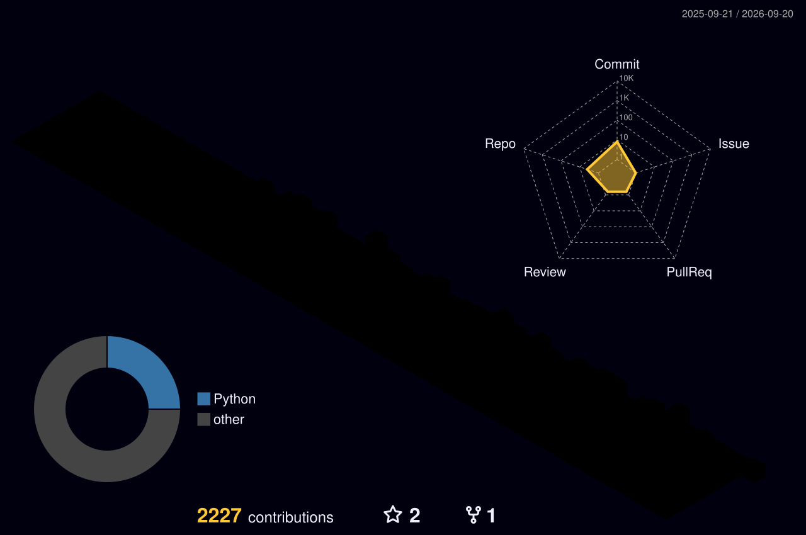

ZIYA KHAN

Software Developer • Educator • Builder

  

~/ whoami

$ cat about.txt

Name      : Ziya Khan
Role      : Software Developer & Educator
Interests : AI | Cloud | DevOps | Software Development
Focus     : Java | Python | JavaScript | TypeScript

~/ toolbox

~/ numbers

~/ languages

~/ profile

~/ contributions

connect • learn • build • innovate

